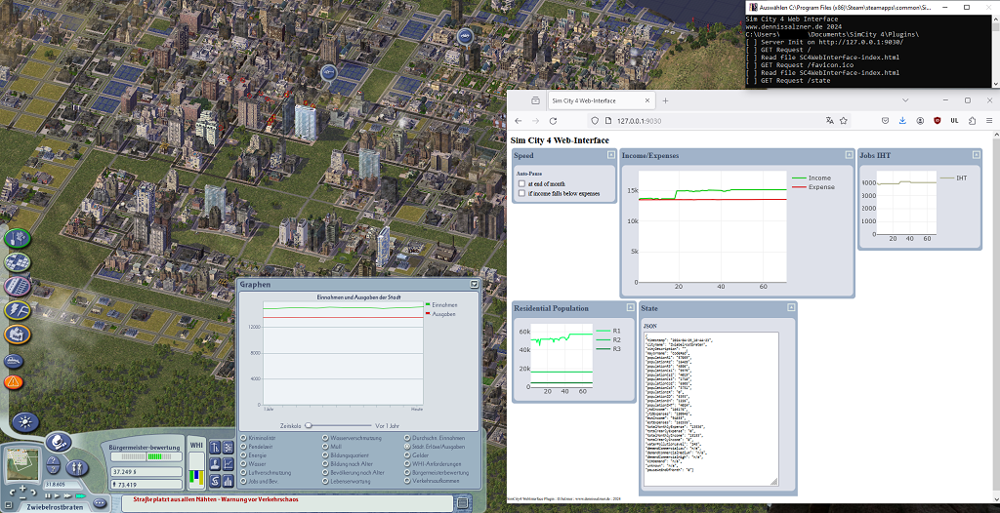

# Sim City 4 Web-Interface Plug-In

A plug-in for Sim City 4 that allows viewing game metrics in a web browser. The web browser can run on a secondary monitor, smart phone or tablet. This adds basic second-screen/multi-monitor capabilities to the game.

The web interface can be edited by altering the included *.html page. It uses AJAX to automatically update game metrics from the plug-in via JSON.

The plug-in supports pausing the game so it can automatically pause the game based on a metric e.g if available power or population fall below a threshold. That way the game can be run unattended without risk.



* [Technical Information](https://www.dennissalzner.de/gamemods/2024/03/31/So-SimCity4Plugins.html)
* [Releases](https://github.com/dsalzner/simcity4-webinterface-plugin/releases)
* [Simtropolis](https://community.simtropolis.com/files/file/36218-sc4webinterface/)

## Dependencies

Inspiration was taken from

* GitHub 0xC0000054/sc4-legalize-gambling-ordinance-upgrade
* GitHub Killeroo/SC4MessageViewer

Dependencies are in the ```lib/``` folder

* GitHub nsgomez/gzcom-dll 
* GitHub Karlson2k/libmicrohttpd
* GitHub arduino/ArduinoCore-avr for WString.c/.h

## Usage

Copy ```SC4WebInterface.dll``` and ```SC4WebInterface_index.html``` to

```
C:\Users\<UserName>\Documents\SimCity 4\Plugins
```

Unblock port 9030/tcp in firewall. For this on administrator PowerShell:

``` 
netsh advfirewall firewall add rule name="Open Port 9030" dir=in action=allow protocol=TCP localport=9030
```

Run the game. It may be helpful to run it in window mode (see below).

Then in your web-browser open

```
http://127.0.0.1:9030/
```

### JSON REST Interface

The JSON state can be directly accessed in case you want to do data analysis/live charts with Python or similar.

```
http://127.0.0.1:9030/state
```

```
{
"timestamp": "xxxx-yy-zz_hh-mm-ss",
"cityName": "n/a",
"cityDescription": "n/a",
"mayorName": "n/a",
"lowWealthPopulation": "n/a",
"medWealthPopulation": "n/a",
"highWealthPopulation": "n/a",
"ytdIncome": "n/a",
"ytdExpenses": "n/a",
"estIncome": "n/a",
"estExpenses": "n/a",
"totalMonthlyExpense": "n/a",
"totalYearlyExpense": "n/a",
"totalMonthlyIncome": "n/a",
"totalYearlyIncome": "n/a",
"pauseAtEndOfMonth": "n/a",
}
```

## Sim City 4 for Window Mode

You may want to add additional parameters to launch the game in window mode and without the intro video

```
-w -intro:off
```

When launching from Steam set these parameters in the Steam game options menu.

## Contributing & Compiling from source

The code can be compiled from source on Windows with Visual Studio 2022.
Alternatively there is a Dummy-Server that can be built and run under Linux.

Anyone is welcome to contribute, see [Guide on Contributing](CONTRIBUTING.md)

## Release History

### v0.0.3

* additional metrics and plots for residential population and high tech industry
* pause when income falls below expense or at end of month
* improved interface, can now show/hide windows, more responsive

### v0.0.2

* Performance improvement. Less frequent internal state updates.
* Pause from the interface now works more reliably. It engages/disengages and when engaged pauses the game at the next simulated month.
* Interface now also shows a plot of income/expenses
* Visual Studio project configuration path fixes

### v0.0.1

* Initial Release
* Interface shows JSON
